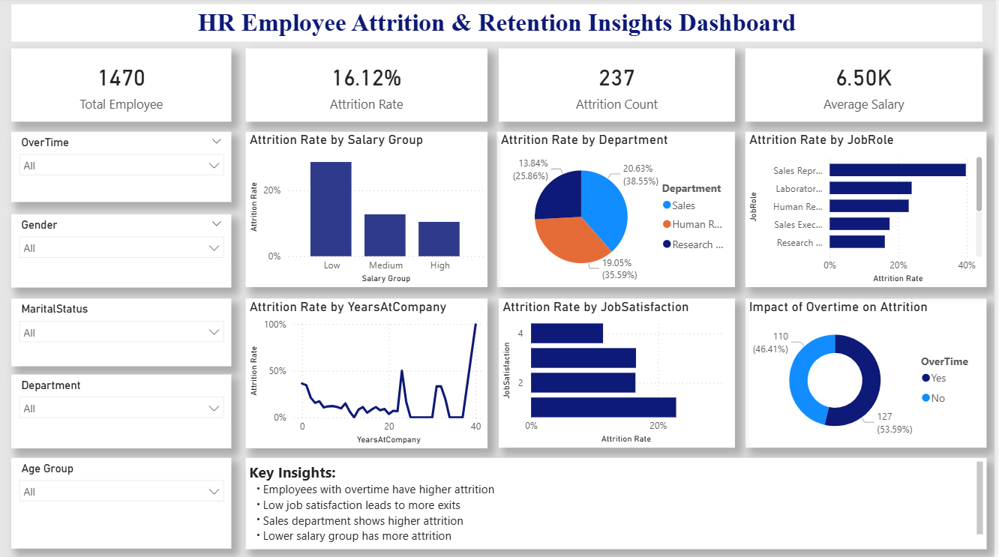

## HR Employee Attrition and Retention Insights

## Project Overview
This project focuses on developing an interactive dashboard using Microsoft Power BI to analyze employee attrition and retention patterns. It highlights key factors influencing employee turnover while also providing insights into retention trends through dynamic visualizations and filters.

---

## Dataset
- HR Employee Attrition Dataset

---

## Objective
To create an interactive report that answers:
What factors influence employee attrition and retention?

The dashboard enables users to explore trends based on:
- Department
- Job Role
- Salary Group
- Job Satisfaction
- Overtime
- Age Group

---

## Tools & Technologies
- Microsoft Power BI
- Data Cleaning & Transformation
- Data Visualization

---

## Dashboard Features

### KPI Cards
- Total Employees
- Attrition Rate
- Attrition Count
- Average Salary

### Visualizations
- Attrition Rate by Department
- Attrition by Job Role
- Attrition by Salary Group
- Attrition by Job Satisfaction
- Attrition by Years at Company
- Impact of Overtime on Attrition

### Interactive Filters
- Gender
- Department
- Age Group
- Marital Status

---

## Key Insights
- Employees working overtime show higher attrition rates  
- Low job satisfaction is strongly linked to employee turnover  
- Sales department experiences relatively higher attrition  
- Lower salary groups tend to have increased attrition  

---

## Dashboard Preview

---

## Dashboard Demo Video

---

## Conclusion
This dashboard provides valuable insights into both employee attrition and retention, helping organizations identify key risk factors and take data-driven actions to improve workforce stability.

---

